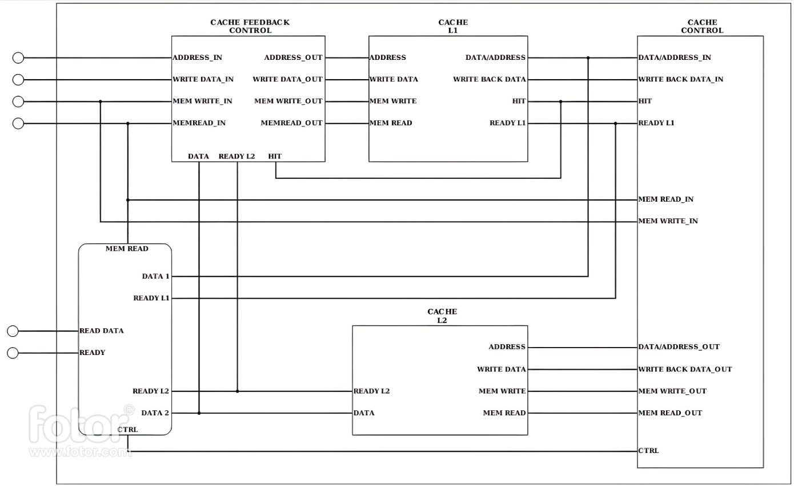

# Project Readme

## Project Overview

This project focuses on the implementation of a MIPS pipelined datapath with a data hazard solution and a two-level cache memory. The objective is to create an efficient and high-performance datapath that can execute MIPS instructions while mitigating data hazards and utilizing cache memory for improved memory access.

## Methodology

Our team adopted a systematic and collaborative approach to complete the project successfully. The methodology involved the following steps:

1. Requirement Analysis: We collectively analyzed the project requirements, including the MIPS instruction set, data hazards, and cache memory specifications. This analysis helped us understand the functionality and constraints of the system.
2. Datapath Design: Based on the requirements, we designed the MIPS pipelined datapath, considering the stages of instruction fetch, instruction decode, execution, memory access, and write back. We incorporated mechanisms to handle data hazards, such as forwarding and stalling.
3. Cache Memory Design: I designed a two-level cache memory system, consisting of CacheL1 and CacheL2 components. This allowed for specialization and efficiency, as I was able to focus on implementing each cache component to the best of my ability.
4. Individual Component Development: Team members worked on their assigned components independently, implementing the datapath and cache memory according to the design specifications. We focused on code modularity, readability, and adherence to VHDL standards.
5. Testing and Integration: After completing the individual component development, we conducted extensive testing on each component to ensure correct functionality. We then integrated the components to create a unified system, testing the interactions and overall performance.
6. Data Hazard Solution: We implemented techniques such as forwarding (data bypassing) and stalling to handle data hazards in the pipelined datapath. These techniques ensured correct data propagation and prevented hazards that could result in incorrect execution.
7. Documentation: We maintained comprehensive documentation throughout the project, including design choices, implementation details, testing procedures, and code explanations. This documentation serves as a valuable resource for understanding and future maintenance of the system.

### Cahce Memory Design

### The program that we used to test the processor is showin in the table below

| Instruction                      | Behavior              |
| -------------------------------- | --------------------- |
| 00000000000000000000000000000000 | NOP                   |
| 00000000000000000000000000000000 | NOP                   |
| 00000000000000000000000000000000 | NOP                   |
| 00000110000000000000000000000010 | $S1 = $S2 + 2         |
| 00000100000000010000000000000010 | $S1 = $S2 + 2         |
| 00000100001000100000000000000010 | $S1 = $S2 + 2         |
| 00000100010000110000000000000010 | $S1 = $S2 + 2         |
| 00001111111000110000000000000000 | Memory[$S2 + 0] = $S1 |
| 00000100011001000000000000000010 | $S1 = $S2 + 2         |
| 00000100100001010000000000000010 | $S1 = $S2 + 2         |
| 00000100101001100000000000000010 | $S1 = $S2 + 2         |
| 00000100110001110000000000000010 | $S1 = $S2 + 2         |
| 00001010101010000000000000000000 | $S1 = Memory[$S2 + 0] |
| 10000001000001110100100000000000 | $S1 = $S2 + $S3       |
| 00001010101010100000000000000001 | $S1 = Memory[$S2 + 0] |
| 00001111111000110000000000100001 | Memory[$S2 + 0] = $S1 |
| 00001111111001000000000001000001 | Memory[$S2 + 0] = $S1 |

## Teamwork and Collaboration

Effective teamwork and collaboration were essential for the success of this project. Our team employed the following practices to enhance collaboration:

1. Regular Meetings: We held regular team meetings to discuss progress, clarify doubts, and align our understanding of the project requirements and goals.
2. Communication Channels: We utilized messaging platforms and collaboration tools to facilitate real-time communication, share ideas, and address challenges.
3. Code Reviews: We conducted code reviews to ensure code quality, identify potential issues, and provide feedback for improvement. This process helped maintain consistency and readability in the codebase.
4. Task Allocation and Tracking: We used task management tools to assign individual tasks, monitor progress, and ensure that project milestones were met. This approach helped us stay organized and focused on individual responsibilities.
5. Knowledge Sharing: We actively shared knowledge and expertise among team members, discussing concepts, algorithms, and best practices. This collaborative learning environment fostered growth and improved the overall quality of the project.

## Conclusion

The completion of the MIPS pipelined datapath with a data hazard solution and two-level cache memory demonstrates our team's dedication, technical skills, and collaborative spirit. By following a systematic methodology and leveraging each team member's expertise, we successfully designed and implemented a high-performance system that can execute MIPS instructions efficiently while mitigating data hazards. Clear documentation and effective communication played crucial roles in ensuring a smooth development process. Overall, this project provided valuable hands-on experience in VHDL development, pipeline design, data hazard handling, and cache memory implementation.

## Contributors

- [Omar Ahmed: 20107196](https://codebyomar.tk/#/)
- [Hassan Mikawi: 20104451](https://github.com/Hassan220022)
- [Omar Alaa](https://github.com/OmarManwar)
- [Ahmed Osama](https://github.com/AhmedOsama45)
- [Ahmed Amr](https://github.com/AhmedDoesCode02)
- [Youssef El Demerdash](https://github.com/YOUSSEFELDEMERDASH)
